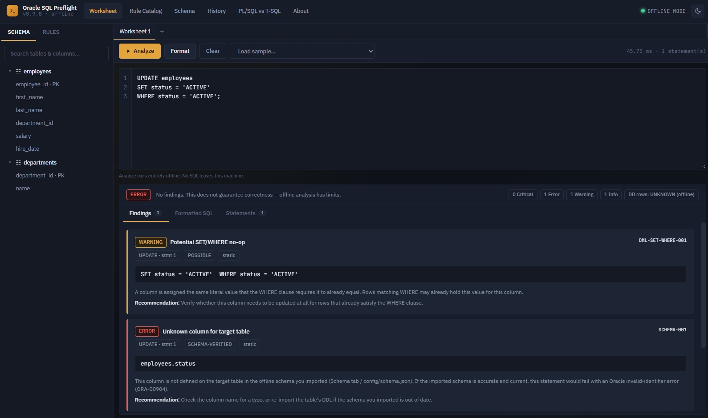

# Oracle SQL Preflight Analyzer

**Version:** 0.1.0 MVP  
**Architecture:** Python + FastAPI + SQLGlot + local browser UI  
**Operating model:** Offline-first, deterministic, AI-free  
**Author:** Federico Guzman ([fedeguzman.com](https://fedeguzman.com) · [weblantropia.com](https://weblantropia.com) · [github.com/kraiosis](https://github.com/kraiosis))  
**Development:** AI-assisted with Claude (Anthropic) — see [§16, Author & Credits](#16-author--credits) for what that means in practice.



> **Trademark disclaimer:** Oracle, Oracle SQL Developer, PL/SQL, Toad, FreeSQL, Transact-SQL
> (T-SQL), SQL Server, SQL Server Management Studio, Azure Data Studio, and every other
> product, tool, or company name mentioned in this document are trademarks or registered
> trademarks of their respective owners. This is an independent, unofficial project, not
> affiliated with, endorsed by, or sponsored by Oracle Corporation or any other company
> named here. See [§16, Author & Credits](#16-author--credits) for the full notice.

## 1. What is this application?

Oracle SQL Preflight Analyzer is a local web-based DBA utility designed to inspect Oracle SQL **before execution**.

The goal is not to replace Oracle SQL Developer or Oracle's tuning tools. Instead, it adds a pre-execution reasoning layer focused on questions such as:

- Is the SQL structurally valid?
- Is an UPDATE missing a WHERE clause?
- Does the SET clause assign the same value required by WHERE?
- Does the WHERE clause contain contradictory equality predicates?
- Could the statement match zero rows?
- Could the statement affect more rows than intended?
- What can be determined without connecting to Oracle?
- What additional checks become possible when connected to a DEV/TEST Oracle database?

The current MVP is intentionally offline and does **not** use AI.

---

# 2. Why use this tool?

Traditional SQL tools are excellent at editing, executing, explaining, tuning, and managing databases. This project is intended to add a different layer:

> **SQL preflight checking before execution.**

For example:

```sql
UPDATE employees
SET
    status = 'ACTIVE',
    department_id = 20
WHERE
    status = 'ACTIVE'
    AND department_id = 20;
```

The SQL can be syntactically valid, yet the SET values are already required by the WHERE clause.

The analyzer can flag this as:

```text
Potential SET/WHERE no-op
```

That does not mean the UPDATE necessarily affects zero rows. It means the matching rows already have those literal values for the analyzed columns.

The future Oracle-connected mode can go further and determine actual matching row counts in a controlled DEV/TEST environment.

## 2.1 How this compares to FreeSQL, Toad for Oracle, and T-SQL tooling

Both FreeSQL and Toad for Oracle are excellent at what they're built for: **running** SQL and PL/SQL against a real database and helping you work inside it once connected. Neither is designed to answer a narrower, earlier question — *"before I run this, does the statement itself look dangerous?"* — and that gap is this project's whole reason to exist.

| | FreeSQL | Toad for Oracle | Oracle SQL Preflight |
|---|---:|---:|---:|
| What it's built for | Browser-based worksheet to write and run SQL/PL/SQL/QuickSQL against a live Oracle DB | Full desktop Oracle IDE & DBA toolkit — schema browser, PL/SQL debugger, session/performance monitoring | A pre-execution reasoning layer for Oracle DML — nothing else |
| Requires a database connection | Yes (Oracle 23ai/26ai) | Yes | **No** — fully offline; a DEV/TEST connection is optional and planned (V0.3) |
| Executes the SQL | Yes — that's the point | Yes | **Never** — analyze first, then take the SQL to FreeSQL/Toad/SQL Developer to actually run it |
| Missing-WHERE / SET-WHERE no-op / contradictory-predicate checks *before* you hit Run | No | No (left to manual review or a generic confirm-before-commit prompt) | **Core purpose** — deterministic, rule-based, with stable rule IDs |
| PL/SQL block & dynamic-SQL (`EXECUTE IMMEDIATE`) recognition | Runs it directly | Runs it directly, plus a PL/SQL debugger | Recognizes and flags it (e.g. string-concatenated dynamic SQL) without ever executing it |
| Installation | None — runs in your browser | Full desktop install | Local Python app, `pip install` + `start.bat`, no cloud account |

In short: FreeSQL and Toad answer *"let me run this against Oracle and see what happens."* This tool answers *"before anyone runs this against anything, what can I already tell just by reading the SQL?"* — the two are complementary, not competing; the natural workflow is Preflight first, then FreeSQL, Toad, or SQL Developer to actually execute.

**On T-SQL:** this analyzer is Oracle/PL-SQL only for now — see the web UI's **PL/SQL vs T-SQL** reference page for a side-by-side syntax comparison covering blocks, cursors, exception handling, dynamic SQL, and more. Support for analyzing Transact-SQL (the dialect behind SQL Server tools like SSMS and Azure Data Studio) — translating the same preflight rules to `EXEC`/`sp_executesql`, T-SQL's `TRY...CATCH`, and its stored-procedure conventions — is planned for a later version.

---

# 3. Current MVP features

## 3.1 Local web application

The application runs locally:

```text
Browser
   |
   v
http://127.0.0.1:8000
   |
   v
FastAPI
   |
   v
SQL analyzer
```

No cloud service is required.

## 3.2 Offline operation

The MVP does not require:

- Internet
- OpenAI/API access
- AI
- Oracle database access
- Database server
- Cloud account

The parser and rule engine execute locally.

## 3.3 Oracle-oriented SQL parsing

The application uses SQLGlot with the Oracle dialect.

The parser produces a structured representation of the SQL instead of relying only on text matching.

Conceptually:

```text
SQL
 |
 v
Parser
 |
 v
Abstract Syntax Tree (AST)
 |
 +---- statement type
 +---- tables
 +---- columns
 +---- SET expressions
 +---- WHERE predicates
 +---- SELECT expressions
 |
 v
Oracle-specific analysis rules
```

## 3.4 UPDATE analysis

The MVP recognizes UPDATE statements and checks:

### Missing WHERE

```sql
UPDATE employees
SET status = 'INACTIVE';
```

Finding:

```text
CRITICAL
UPDATE has no WHERE clause

This statement can update every row in the target table.
```

### SET/WHERE no-op

```sql
UPDATE employees
SET status = 'ACTIVE'
WHERE status = 'ACTIVE';
```

Finding:

```text
WARNING
Potential SET/WHERE no-op

STATUS is assigned the same literal value
required by WHERE.
```

### Multiple contradictory equality conditions

```sql
UPDATE employees
SET status = 'ACTIVE'
WHERE department_id = 10
  AND department_id = 20;
```

Finding:

```text
WARNING
Contradictory WHERE equality

DEPARTMENT_ID is required to equal
multiple different values.
```

### Constant-false predicate

```sql
UPDATE employees
SET status = 'ACTIVE'
WHERE 1 = 2;
```

Finding:

```text
WARNING
Constant-false predicate

The statement may affect zero rows.
```

## 3.5 DELETE safety checks

Example:

```sql
DELETE FROM employees;
```

The analyzer reports that the DELETE has no WHERE clause and may delete every row.

## 3.6 INSERT/MERGE recognition

The MVP recognizes INSERT and MERGE and explains that data-dependent validation requires Oracle metadata/data.

## 3.7 SELECT * detection

Example:

```sql
SELECT *
FROM employees;
```

The analyzer reports that SELECT * is present.

This is currently an informational rule, not a claim that SELECT * is always wrong.

## 3.8 SQL formatting

The Format function reformats parsed SQL using the Oracle dialect.

## 3.9 Rule IDs

Findings use stable identifiers such as:

```text
DML-001
DML-002
DML-SET-WHERE-001
DML-WHERE-002
DML-WHERE-003
PERF-001
PARSE-001
```

This will allow future versions to document, enable/disable, test, and customize individual rules.

---

# 4. What offline mode cannot know

Static analysis is intentionally conservative.

Without database data, the application cannot truthfully say:

```text
UPDATE will affect 1,283 rows
```

because it has not seen the data.

Instead it says:

```text
Database rows: UNKNOWN (offline mode)
```

This distinction is important.

### Static analysis

```text
SQL
 |
 v
Structure + logic
 |
 v
Potential findings
```

### Oracle-assisted analysis

```text
SQL
 |
 +--> Parser/rules
 |
 +--> Oracle metadata
 |
 +--> Oracle optimizer
 |
 +--> controlled COUNT/simulation
 |
 v
Actual database-assisted findings
```

---

# 5. Architecture

```text
                 ORACLE SQL PREFLIGHT
                         |
                 +-------+-------+
                 |               |
             Web UI          API Layer
                 |               |
                 +-------+-------+
                         |
                     FastAPI
                         |
                 +-------+-------+
                 |               |
              Parser          Rule Engine
             SQLGlot              |
                 |                |
                 +-------+--------+
                         |
                  Logical Analyzer
                         |
              +----------+----------+
              |                     |
        Offline Mode          Oracle TEST Mode
              |                     |
       Static findings        Metadata / plans /
                              controlled analysis
```

The project is intentionally structured so Oracle connectivity can be added without replacing the offline analyzer.

---

# 6. Parser/linter foundation + Oracle logical engine

The project should not reinvent SQL parsing.

The foundation is:

```text
              SQLFluff / SQLGlot-style foundation
                         |
                         v
                    SQL Parser
                         |
                         v
                  Abstract Syntax Tree
                         |
                         v
              +-----------------------+
              | Oracle Logic Engine   |
              +-----------------------+
              | DML safety            |
              | SET/WHERE reasoning   |
              | Contradictions        |
              | Zero-row conditions   |
              | Oracle rules          |
              | Impact analysis       |
              +-----------------------+
                         |
                         v
                  DBA Preflight Report
```

The important project-specific layer is the **Oracle logical analysis engine**.

A generic parser can understand that:

```sql
SET status = 'A'
```

is an assignment.

Our engine can reason that:

```sql
WHERE status = 'A'
```

may make that assignment a no-op for matching rows.

That is the direction that differentiates this project from a normal SQL formatter or linter.

---

# 7. Closest existing tools

The comparison below is conceptual and describes the intended role of each tool.

| Tool | SQL editing/execution | Oracle focus | Offline/static analysis | Performance tuning | SET/WHERE logical analysis | Actual DB impact |
|---|---:|---:|---:|---:|---:|---:|
| Oracle SQL Developer | Yes | Yes | Partial | Yes | Limited | Yes |
| Oracle SQL Tuning Advisor | No/limited editor role | Yes | No | **Core purpose** | No | Yes |
| SQLFluff | No DB execution | Oracle dialect | **Yes** | Limited | Limited/custom rules | No |
| Oracle SQL Preflight | Yes/local editor | **Oracle-focused** | **Yes** | Planned | **Core purpose** | Planned |

The project is therefore intended to complement, not replace, these tools.

---

# 8. Installation

## Requirements

Recommended:

- Windows 10/11
- Python 3.11 or newer
- A modern browser such as Edge or Chrome

Oracle is **not required for the current MVP**.

## Install manually

Open PowerShell in the project directory:

```powershell
python -m venv .venv
```

Activate:

```powershell
.venv\Scripts\activate
```

Install dependencies:

```powershell
pip install -r requirements.txt
```

Run:

```powershell
python -m app.main
```

Open:

```text
http://127.0.0.1:8000
```

## Windows shortcut

The project includes:

```text
start.bat
```

Run it to create the virtual environment, install dependencies if necessary, start the server, and open the local application.

---

# 9. First test

Paste:

```sql
UPDATE employees
SET
    status = 'ACTIVE'
WHERE
    status = 'ACTIVE';
```

Click:

```text
Analyze
```

Expected result:

```text
WARNING
Potential SET/WHERE no-op
```

Now test:

```sql
UPDATE employees
SET status = 'INACTIVE'
WHERE status = 'ACTIVE';
```

This should not trigger the same no-op rule because SET and WHERE specify different literal values.

---

# 10. Sample SQL test library

## Test 1 — Dangerous UPDATE

```sql
UPDATE employees
SET salary = salary * 1.10;
```

Expected:

```text
CRITICAL
UPDATE has no WHERE clause
```

---

## Test 2 — Dangerous DELETE

```sql
DELETE FROM employees;
```

Expected:

```text
CRITICAL
DELETE has no WHERE clause
```

---

## Test 3 — Potential no-op

```sql
UPDATE employees
SET status = 'ACTIVE'
WHERE status = 'ACTIVE';
```

Expected:

```text
WARNING
Potential SET/WHERE no-op
```

---

## Test 4 — Contradictory condition

```sql
UPDATE employees
SET status = 'ACTIVE'
WHERE department_id = 10
  AND department_id = 20;
```

Expected:

```text
WARNING
Contradictory WHERE equality
```

---

## Test 5 — Zero-row condition

```sql
UPDATE employees
SET status = 'ACTIVE'
WHERE 1 = 2;
```

Expected:

```text
WARNING
Constant-false predicate
```

---

## Test 6 — SELECT *

```sql
SELECT *
FROM employees;
```

Expected:

```text
INFO
SELECT * detected
```

---

# 11. Testing philosophy

The analyzer should distinguish:

### Proven by syntax/logic

```text
The WHERE clause contains 1 = 2.
```

### Strong static indication

```text
STATUS is assigned 'ACTIVE' while WHERE requires
STATUS = 'ACTIVE'.
```

### Requires database data

```text
Exactly 473 rows match.
```

### Requires Oracle execution/optimizer

```text
This particular execution plan will be used.
```

The application should never manufacture database facts when operating offline.

---

# 12. Project structure

```text
OracleSQLPreflight/
|
+-- app/
|   +-- main.py
|   +-- analyzer/
|   |   +-- engine.py
|   |
|   +-- web/
|       +-- templates/
|       |   +-- index.html
|       |
|       +-- static/
|           +-- app.js
|           +-- app.css
|
+-- config/
|   +-- config.json
|
+-- tests/
|   +-- test_engine.py
|
+-- requirements.txt
+-- start.bat
+-- README.md
+-- scope.md
```

---

# 13. Security model

The MVP is local-only.

The server binds to:

```text
127.0.0.1
```

rather than exposing the application to the network.

Future Oracle credentials should be stored using a secure mechanism rather than plain text configuration.

The application should also separate:

```text
ANALYZE
SIMULATE
EXECUTE
```

so that analyzing SQL never implicitly executes it.

---

# 14. Development roadmap

See `scope.md` for the complete planned feature set.

The major progression is:

```text
V0.1
Offline parser + basic rules
        |
        v
V0.2
Expanded Oracle logical rules
        |
        v
V0.3
Oracle DEV/TEST connection
        |
        v
V0.4
Impact simulation
        |
        v
V0.5
Execution plans + metadata
        |
        v
V0.6
DBA workspace/history/reports
        |
        v
V1.0
Production-ready Oracle SQL Preflight platform
```

---

# 15. Design principle

The core principle is:

> **Analyze first. Simulate second. Execute last.**

The application should help a DBA identify potential problems before changing data.

AI is intentionally not part of the core design. Rules should be deterministic, testable, documented, and reproducible.

---

# 16. Author & Credits

**Name:** Oracle SQL Preflight
**Author:** Federico Guzman
**Website:** [fedeguzman.com](https://fedeguzman.com)
**Blog:** [weblantropia.com](https://weblantropia.com)
**GitHub:** [github.com/kraiosis](https://github.com/kraiosis)

## AI-assisted development

This codebase was built with AI assistance from **Claude** (Anthropic) — pair-programming
on the parser/rule-engine architecture, the rule catalog, the test suite, and the web UI,
under the author's direction and review.

This is a statement about *how the project was built*, not about *how it works*. The
distinction in §15 still holds at runtime: the shipped analyzer itself is deterministic
and AI-free — every finding comes from the SQLGlot AST and the rule engine in
`app/analyzer/`, never from a language model, and that stays true regardless of which
tools were used to write the code. Source files carry a short header identifying this;
see `app/main.py` and the modules under `app/analyzer/` for the fuller note.

## Trademarks & disclaimer

Oracle, Oracle Database, Oracle SQL Developer, Oracle SQL Tuning Advisor, PL/SQL, and
SQL*Plus are trademarks or registered trademarks of Oracle Corporation and/or its
affiliates. Toad and Toad for Oracle are trademarks of Quest Software Inc. FreeSQL and
freesql.com are Oracle's own product/site and referenced here purely for factual,
descriptive comparison (§2.1). Transact-SQL (T-SQL), SQL Server, SQL Server Management
Studio (SSMS), and Azure Data Studio are trademarks of Microsoft Corporation. SQLFluff
and SQLGlot are the property of their respective open-source maintainers/projects.
Claude and Anthropic are trademarks of Anthropic, PBC.

All product, service, and company names referenced in this repository — in this README,
in `scope.md`, in `CHANGELOG.md`, in the source code, or in the web UI — are used for
identification and comparison purposes only and remain the property of their respective
owners. Use of these names does not imply any affiliation with or endorsement by their
owners. This project is independent and unofficial: it is not produced, endorsed,
maintained, or supported by Oracle Corporation, Quest Software, Microsoft Corporation, or
any other company named in this repository.

